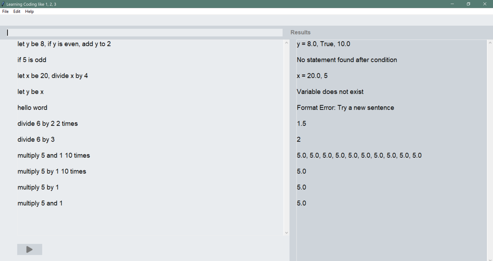

# Learning Coding Like 1, 2, 3

In this project, we are going to design and implement an algorithm developer software for young children who can read and write but do not know how to program. This software helps children to experiment (write, simulate, modify) with algorithms written in a natural language like English. Our team has chosen to develop an editor with a calculator's functionality. 


## Table of Contents
- [Requirements](#requirements)
- [Check Installation](#check-installation)
- [Screenshots](#screenshots)
- [Coding Standards](#coding-standards)
- [Folder Structure](#folder-structure)
- [Team Members](#team-members)

## Requirements

This project is fully written in **Python 3**. To clone this repo and run the program, we need:
- **Python** (3.7 or later)
- **Tkinter Library** (include everything to run Tk out of the box if Python 3.7 or later is installed)

## Check Installation

- Check Python version

```shell
python --version
                Python 3.10.0
```

- Check whether Tkinter is installed properly on the system

```shell
python -m tkinter
                (a window demonstrating a simple Tk interface will be opened)
```
## Screenshots


## Coding Standards
Collections of rules and guidelines that determine the programming style, procedures, and methods for a programming language can be found in ```StyleGuide.py```

## Folder Structure
```
📦.vscode
 ┗ 📜settings.json
 
📦Images
 ┗ 📜run_button.png
 
📦Project
 ┣ 📂Scripts
 ┃ ┣ 📂Components
 ┃ ┃ ┣ 📂__pycache__
 ┃ ┃ ┃ ┣ 📜algorithm.cpython-310.pyc
 ┃ ┃ ┃ ┣ 📜assignment.cpython-310.pyc
 ┃ ┃ ┃ ┣ 📜calculate.cpython-310.pyc
 ┃ ┃ ┃ ┣ 📜conditional.cpython-310.pyc
 ┃ ┃ ┃ ┣ 📜Interpreter.cpython-310.pyc
 ┃ ┃ ┃ ┗ 📜loop.cpython-310.pyc
 ┃ ┃ ┣ 📜algorithm.py
 ┃ ┃ ┣ 📜assignment.py
 ┃ ┃ ┣ 📜calculate.py
 ┃ ┃ ┣ 📜conditional.py
 ┃ ┃ ┗ 📜Interpreter.py
 ┃ ┣ 📂Editor
 ┃ ┃ ┗ 📂__pycache__
 ┃ ┃ ┃ ┗ 📜editor.cpython-310.pyc
 ┃ ┣ 📜editor.py
 ┃ ┗ 📜StyleGuide.py
 ┗ 📜.DS_Store
 ```
## Team Members:
- Annika Timermanis
- George Mavroeidis
- Jahrel Stewart
- Axel Solano
- Phuong Anh Trinh
- Jordan Chan Kum Sang
