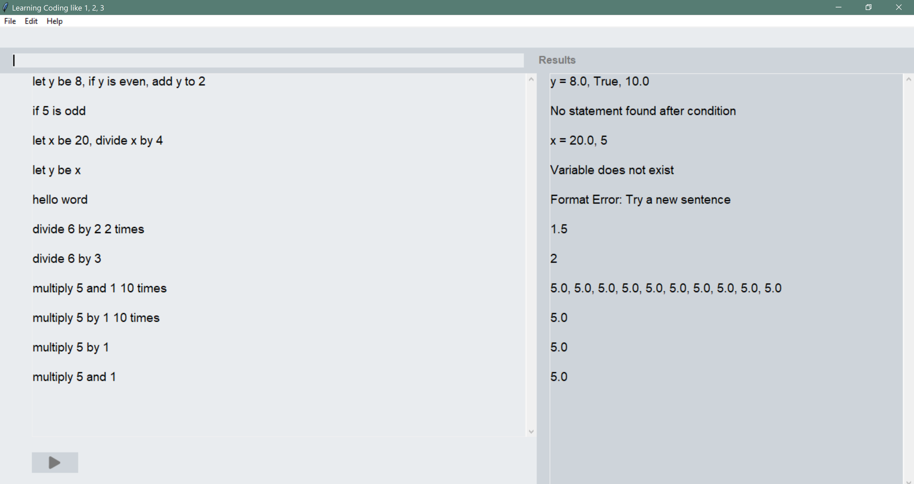
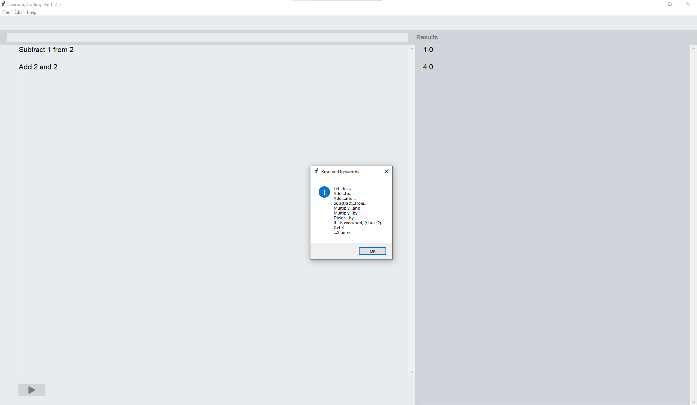
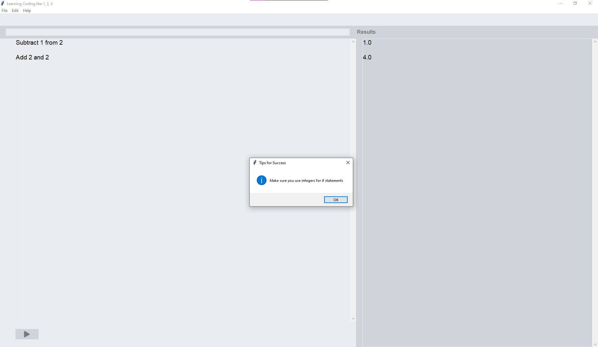

# Learning Coding Like 1, 2, 3

In this project, we are going to design and implement an algorithm developer software for young children who can read and write but do not know how to program. This software helps children to experiment (write, simulate, modify) with algorithms written in a natural language like English. Our team has chosen to develop an editor with a calculator's functionality. 


## Table of Contents
- [Requirements](#requirements)
- [Repository](#repository)
- [Check Installation](#check-installation)
- [How to Run the Project](#how-to-run-the-project)
- [Screenshots](#screenshots)
- [Coding Standards](#coding-standards)
- [Folder Structure](#folder-structure)
- [Team Members](#team-members)

## Requirements

This project is fully written in **Python 3**. To clone this repo and run the program, we need:
- **Python** (3.7 or later)
- **Tkinter Library** (include everything to run Tk out of the box if Python 3.7 or later is installed)

## Repository

- This is the link to the github repository of the project: https://github.com/George540/learn_code_like_123
- To clone it, here is the HTTPS link: https://github.com/George540/learn_code_like_123.git

Clone main branch for the latest version of the project.

## Check Installation

- Check Python version

```shell
python --version
                Python 3.10.0
```

- Check whether Tkinter is installed properly on the system

```shell
python -m tkinter
                (a window demonstrating a simple Tk interface will be opened)
```

## How to Run the Project

```shell
$ python editor.py
```

📓 Click ```Help``` to see ```Dictionary``` and ```Tips``` to execute the text editor

📓 Hit ```Enter``` in keyboard or click ```Run``` button to see the result of inputted sentences

📓 The results can be saved as file if desired. Click ```File``` -> ```Save Logs as File``` -> name of the file -> ```Save```

## Screenshots




## Coding Standards
Collections of rules and guidelines that determine the programming style, procedures, and methods for a programming language can be found in ```StyleGuide.py```

## Folder Structure
```
📦Images
 ┗ 📜run_button.png
 
📦Project
 ┣ 📂Scripts
 ┃ ┣ 📂Components
 ┃ ┃ ┣ 📂__pycache__
 ┃ ┃ ┃ ┣ 📜algorithm.cpython-310.pyc
 ┃ ┃ ┃ ┣ 📜assignment.cpython-310.pyc
 ┃ ┃ ┃ ┣ 📜calculate.cpython-310.pyc
 ┃ ┃ ┃ ┣ 📜conditional.cpython-310.pyc
 ┃ ┃ ┃ ┣ 📜Interpreter.cpython-310.pyc
 ┃ ┃ ┃ ┗ 📜loop.cpython-310.pyc
 ┃ ┃ ┣ 📜algorithm.py
 ┃ ┃ ┣ 📜assignment.py
 ┃ ┃ ┣ 📜calculate.py
 ┃ ┃ ┣ 📜conditional.py
 ┃ ┃ ┗ 📜Interpreter.py
 ┃ ┣ 📂Editor
 ┃ ┃ ┗ 📂__pycache__
 ┃ ┃ ┃ ┗ 📜editor.cpython-310.pyc
 ┃ ┣ 📜editor.py
 ┃ ┗ 📜StyleGuide.py
 ┗ 📜.DS_Store
 
 📦Reports
 ┣ 📜GroupJ-Assignment1-COMP354.pdf
 ┣ 📜GroupJ-Assignment2-COMP354.pdf
 ┣ 📜GroupJ-Assignment3-COMP354.pdf
 ┗ 📜GroupJ-Assignment4-COMP-354.pdf
 
📦Screenshots
 ┣ 📜screenshot1.png
 ┣ 📜screenshot2-dictionary.png
 ┗ 📜screenshot3-tips.png
 ```
## Team Members:
- Annika Timermanis: 40131128
- George Mavroeidis: 40065356
- Phuong Anh Trinh: 40069870
- Jahrel Stewart: 40115728
- Jordan Chan Kum Sang: 40125997
- Axel Solano: 40046154
